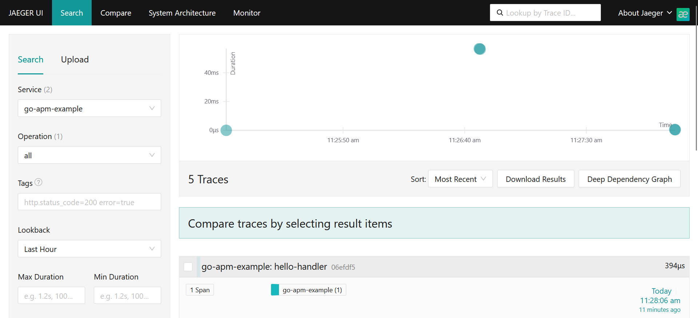

# Go Apm with opentelemetry

## Installation

```bash
go get go.opentelemetry.io/otel \
       go.opentelemetry.io/otel/sdk \
       go.opentelemetry.io/contrib/instrumentation/net/http/otelhttp \
       go.opentelemetry.io/otel/exporters/jaeger

```

## Tracer Provider

using docker

```bash
docker run -d --name jaeger \
  -p 16686:16686 \
  -p 14268:14268 \
  jaegertracing/all-in-one:latest
```

## Jeager UI

Dashboard using Jeager UI for see the traces


